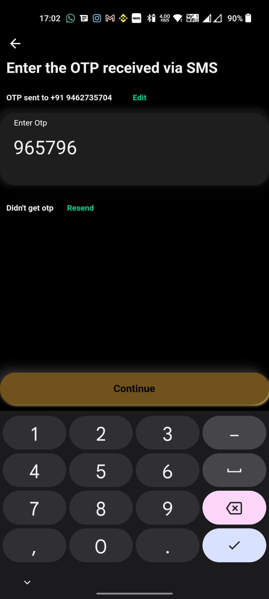
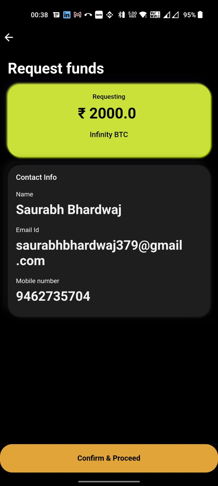
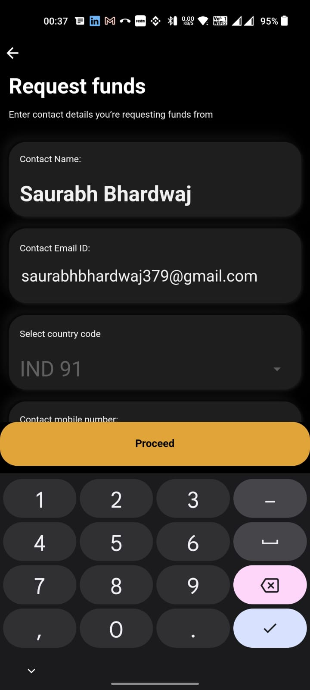
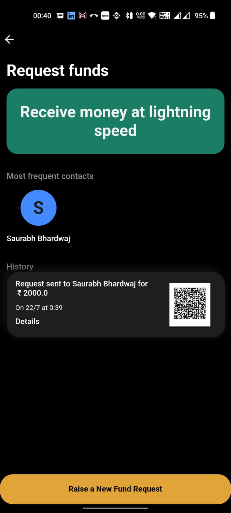
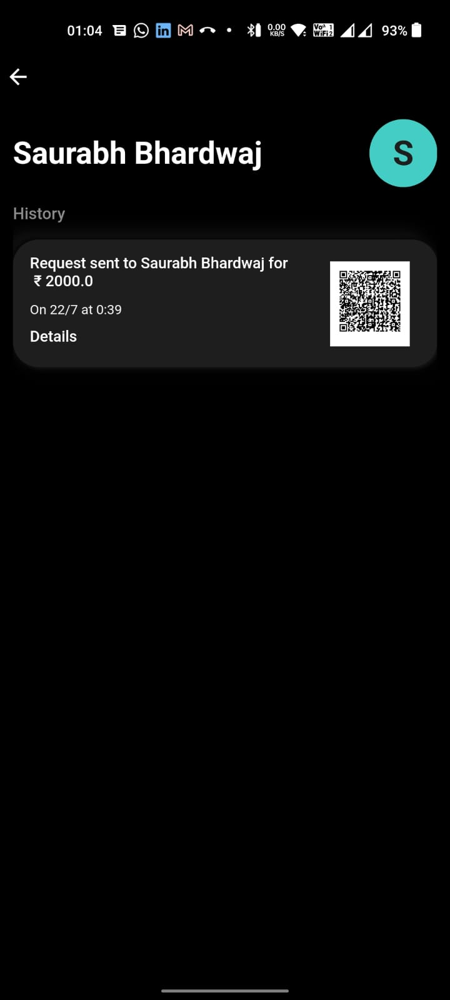
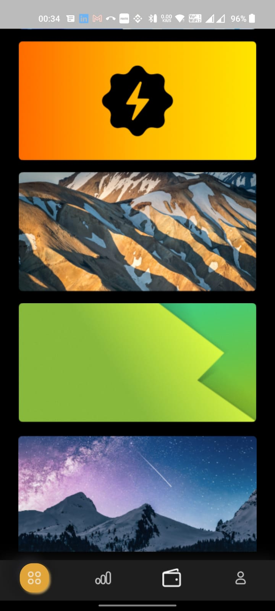

# apkbugs
## Signup/Login

1. Continue button not enabled even after entering otp

## Receive Flow

1. Horizontal line above "confirm & proceed" button
2. Box borders not sharp

1. Contact mobile number hides behind keyboard and has to be manually scrolled up

1. "Receive money at lightening speed" text alignment not as per figma
2. Funds history time format should be 00:39
3. Margin right below History missing
4. Most frequent contacts
  1. Should contain "SB" in circle as per Figma
  2. Should contain Saurabh in text
5. Details must be underlined as per clickable convension

1. Prefix "Mr/Ms." missing in name as per figma
2. Details must be underlined

## Home

1. Hello user @username sizes not as per figma
2. Bell icon color different than figma
3. Bottom orange button elevation looking hazy
4. Button shadow going on scroll page

1. After scrolling to bottom, last item bottom border radius missing

## Wallet screen

