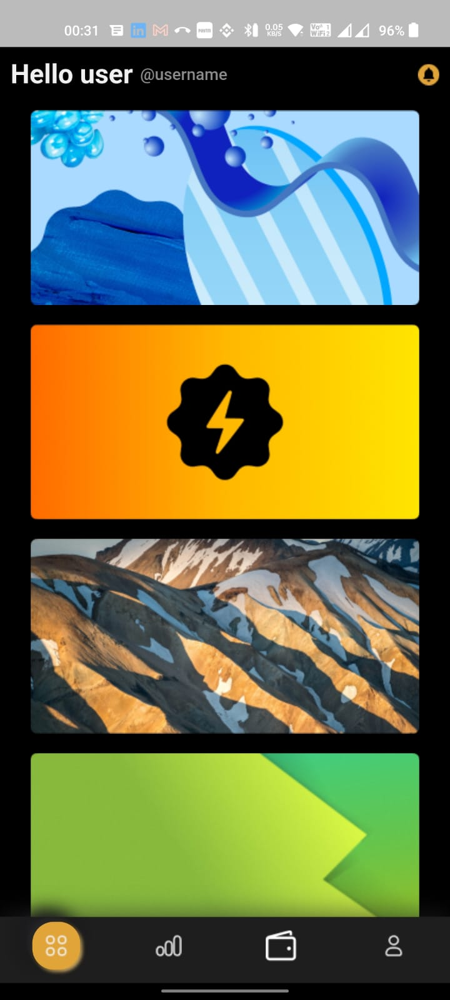
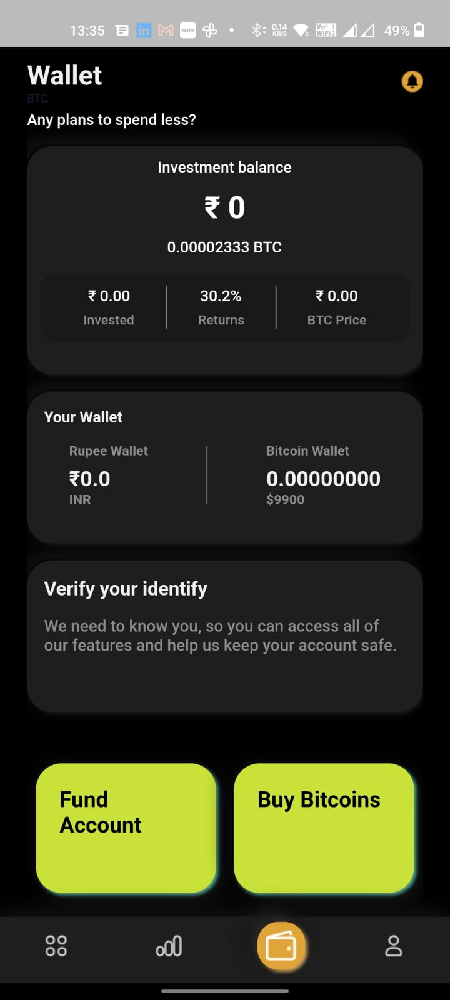
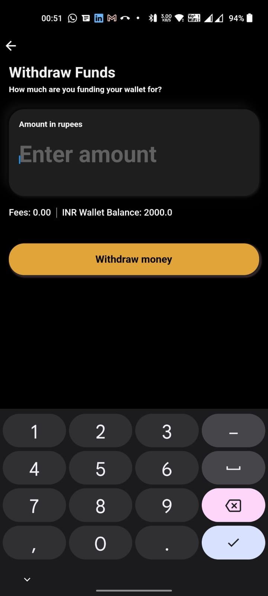
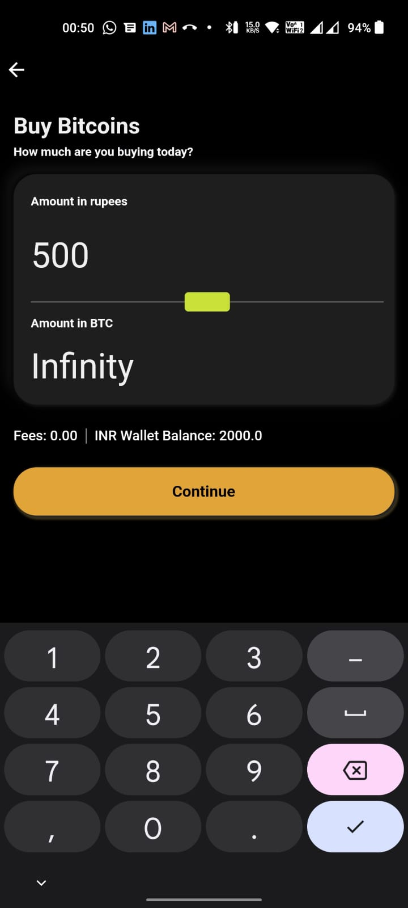
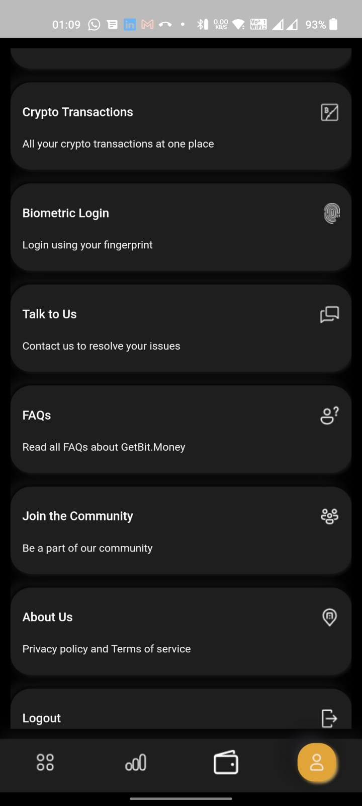
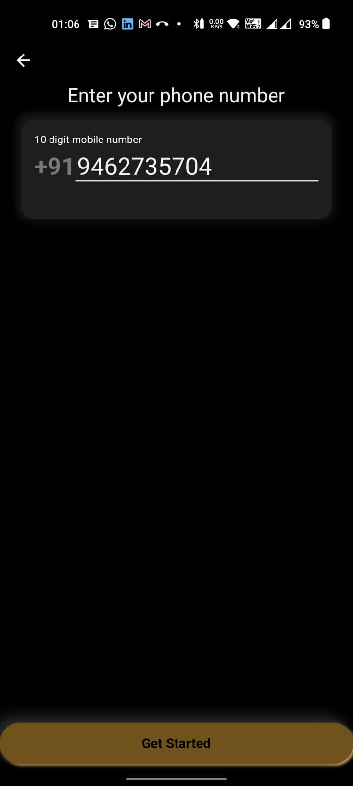
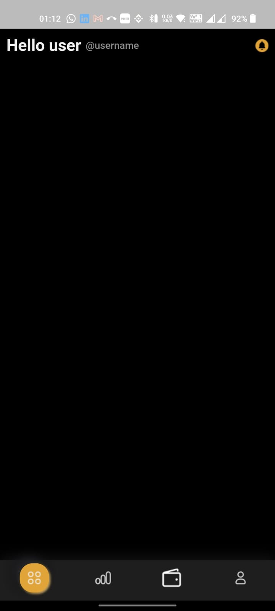

# apkbugs

## Signup/Login

1. Continue button not enabled (but still clickable) even after entering otp 
2. Wrong otp not giving error, infinite loading animation is there.

## Receive Flow

1. Horizontal line above "confirm & proceed" button
2. Box borders not sharp

1. Contact mobile number hides behind keyboard and has to be manually scrolled up

1. "Receive money at lightening speed" text alignment not as per figma
2. Funds history time format should be 00:39
3. Margin right below History missing
4. Most frequent contacts
  a. Should contain "SB" in circle as per Figma
  b. Should contain Saurabh in text
5. Details must be underlined as per clickable convension

1. Prefix "Mr/Ms." missing in name as per figma
2. Details must be underlined

## Home

1. Hello user @username sizes not as per figma
2. Bell icon color different than figma
3. Bottom orange button elevation looking hazy
4. Button shadow going on scroll page

1. After scrolling to bottom, last item bottom border radius missing

## Wallet screen

1. Green boxes margin inconsistent (according to figma, margins should be 24px)
2. Receive money button (bell icon) not clickable from here.

### At fund account screen, the A/c Number, IFS etc are not copyable and remarks are missing as per figma. 

1. Withdraw funds screen, input text size and color

1. Buy/Sell Bitcoin screen, user should be able to input the amount in rupees or btc both. Currently, the amount in btc is not editable.

## Profile

1. Scrollable items should go behind footer, currently a margin is there.

## Logout

1. After logout, the mobile number is there but get started button not active

## App reopen after successful logout

1. Reopening app after successful login doesn't shou signup page, instead empty page is visible. 
